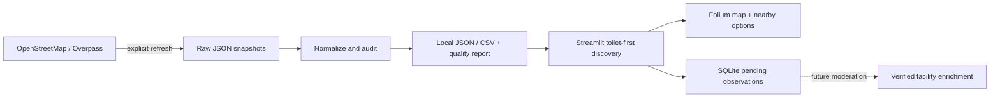

# Lokito — find what you need, nearby

A working, local **Jakarta public-facility discovery MVP** for an academic Venture Creation project. Built with Python, Streamlit, Pandas, Folium and SQLite.

**Real seed snapshot:** 5,824 OpenStreetMap objects downloaded on 14 September 2026: **141 toilets, 5,645 places of worship, and 38 drinking-water points**. No facility records or verification records were invented. See [DATA_QUALITY.md](DATA_QUALITY.md) for measured completeness and limitations.

## Problem and solution

People can find a mall or station on a conventional map, yet still need to investigate whether it provides the particular facility they need. Lokito opens directly with the nearest mapped toilet, shows what is known about it, and offers a clear directions handoff. The name means **Lokasi Toilet**; prayer spaces and drinking water are secondary options. Jakarta is the pilot; Indonesia-wide expansion is a future phase.

## Features

- Toilet-first discovery with a featured nearest option, nearby cards and a coordinated selected map pin.
- Prayer spaces and drinking water under Other facilities; accessibility, free and public access under Preferences.
- Interactive map with clusters, warm numbered pins and concise popups.
- Approximate landmark starting points or custom latitude/longitude; nearest options ranked by Haversine distance.
- Radius, name/address, religion, wheelchair, fee and explicit-access filters.
- Designed facility-detail dialog and Google Maps walking-directions handoff.
- Separate Data & trust view for original OSM links, tags, refresh/edit timestamps and downloads.
- Explicit unknowns: no inferred opening status, cleanliness, accessibility or verification.
- Full-snapshot Data & trust view, category counts, attribute completeness and download options.
- Local SQLite observation form with availability, optional cleanliness and issue notes. All reports remain pending review.
- Separate raw snapshots and normalized JSON/CSV; the app never queries Overpass on a normal page load.
- Separate venue context for malls, SPBU, stations and six other venue categories, with conservative “near”, “at” and “inside” wording.
- Licensed Wikimedia venue photographs, source/creator/licence links, and optional Google Places photos when configured.
- Product feedback stored separately from facility observations, with password-gated owner results.
- Business context and demo material, plus tested offline API fallback.

## Quick start on this computer

The virtual environment and real dataset are already installed in this folder:

```bash
cd "/Users/hugowahyubagas/Documents/Venture Creation"
source .venv/bin/activate
python -m streamlit run app.py --server.address 127.0.0.1 --server.port 8501
```

Open [Lokito](http://127.0.0.1:8501). If it is already running, open that address directly. Stop a terminal-launched server with Ctrl+C. If port 8501 is occupied by another app, use `--server.port 8502` and open port 8502.

## Install on another computer

Use Python 3.12 (tested); Python 3.11+ should work but was not tested here. Copy the source and `data/raw`, `data/processed` and `data/enrichment` folders, excluding `.venv` and local SQLite databases.

macOS/Linux, from the copied project folder:

```bash
python3 -m venv .venv
source .venv/bin/activate
python -m pip install -r requirements.txt
python -m streamlit run app.py --server.address 127.0.0.1 --server.port 8501
```

Windows PowerShell, from the copied project folder:

```powershell
py -3.12 -m venv .venv
.venv\Scripts\python.exe -m pip install -r requirements.txt
.venv\Scripts\python.exe -m streamlit run app.py --server.address 127.0.0.1 --server.port 8501
```

`requirements.txt` keeps direct dependencies small. Streamlit **1.63+** is required for stateful popovers; the tested lock pins 1.63.0. `requirements-lock.txt` records every exact package version used for this run; install it instead to reproduce this tested environment where compatible wheels are available. No keys, accounts, Docker or cloud infrastructure are required.

## Data acquisition and audit

For venue context and photos, use the **separate enrichment command** below. The original facility snapshot was preserved during this iteration. The facility ingestion refresh further down deliberately replaces the seed and is not needed to update venues.

```bash
python -m facility_finder.enrich_places
python -m facility_finder.enrich_places --refresh --photo-limit 60
```

The first command reads a valid existing enrichment cache without remote calls. If none exists, it acquires one. The refresh explicitly queries venue geometry and media; failures retain the last valid cache. Normal app reruns read local data. Browser image and map-tile requests still need internet.

The 6 October cache adds context to **1,170 facilities**, including **65 of the 141 toilets**. **36 facilities, including 21 toilets**, have Wikimedia venue photographs. See [the enrichment handover](docs/ENRICHMENT_HANDOVER.md) for relationship counts, thresholds, setup, feedback privacy, QA and limitations.

### Optional Google Places and owner feedback access

The app runs fully without Google credentials. `.env.example` lists supported variables; `.env` files are **not automatically loaded**. Configure variables in the same terminal used to start Streamlit, or in your hosting environment. For macOS zsh, this prompts without displaying the key:

```bash
read -rs "GOOGLE_MAPS_API_KEY?Google Maps API key: "
export GOOGLE_MAPS_API_KEY
export LOKITO_PRIVACY_URL="https://your-domain.example/privacy"
export LOKITO_TERMS_URL="https://your-domain.example/terms"
python -m facility_finder.enrich_places --google-map-ids
```

Replace the two example URLs with your published policies. Enable Places API (New) and billing in your Google Cloud project, restrict the key to the required API and your server where practical, and set quotas/budget alerts. The ID-matching command may incur charges; it processes at most 50 unique venues per invocation. Google photos require a separate explicit click and are displayed on a separate page without an OSM map. Only Place IDs persist. Full policy and billing boundaries are in the handover.

To unlock private feedback results under Data & trust:

```bash
read -rs "LOKITO_OWNER_PASSWORD?Owner results password: "
export LOKITO_OWNER_PASSWORD
python -m streamlit run app.py --server.address 127.0.0.1 --server.port 8501
```

Choose your own password. Leave the variable unset to keep results unavailable. Feedback is stored in `data/product-feedback.sqlite3` on the machine running the app. A hosted app needs durable storage and appropriate access controls before relying on this file for research. GitHub stores the code; pushing the repository does not itself host the running app.

### Original facility ingestion

Use the supplied cache without making an external request:

```bash
python -m facility_finder.ingest
python -m facility_finder.report
```

Request a fresh seed deliberately:

```bash
python -m facility_finder.ingest --refresh
python -m facility_finder.report
```

The script resolves the OSM administrative area tagged `ISO3166-2=ID-JK` (observed area ID `3606362934`, based on relation `6362934`). It queries **nodes, ways and relations** for `amenity=toilets`, `amenity=place_of_worship`, and `amenity=drinking_water`, using `out meta center`.

GET queries succeeded in this environment; initial POST requests failed. The downloader makes bounded sequential attempts with backoff across two public Overpass endpoints. If a full query fails on an initial acquisition, it attempts each category separately, with pauses. It rejects Overpass error/timeout remarks. If a refresh fails and a valid complete raw cache exists, it logs the error and preserves that cache and its original timestamp. Individual successful query snapshots are also retained for inspection. A completely failed initial acquisition stops visibly; it does not generate dummy data.

The app reads processed files locally and detects changes by modification timestamp. Refreshing data is an explicit terminal operation, preventing ordinary app interactions from burdening Overpass.

### Data model

One normalized row represents one qualifying OSM object, keyed by `osm_type/osm_id`. Same numeric IDs across element types remain distinct. Exact duplicate IDs are removed; nearby physical representations are only flagged, not silently merged.

Fields include `facility_id`, `osm_type`, `osm_id`, `name`, `facility_category`, `latitude`, `longitude`, `coordinate_method`, `address`, `access`, `fee`, `opening_hours`, `wheelchair`, `operator`, `changing_table`, `religion`, `denomination`, `source`, `source_url`, `last_data_refresh`, `osm_last_edited`, `osm_check_date`, `verification_status`, `last_verified_at`, and original `tags`.

Missing text is consistently `unknown`. Missing platform verification timestamps are JSON `null`. “Toilet” is a UI fallback label, not an invented source name. Ways and relations use bounding-box centers rather than entrance coordinates.

## Project structure

```text
app.py                         Streamlit discovery, Data & trust and About views
facility_finder/
  ingest.py                    Overpass querying, retries and raw caching
  data.py                      Normalization, quality audit, filters and Haversine
  maps.py                      Folium map, numbered markers and escaped popups
  presentation.py              Selection, formatting and directions URLs
  ui.py                        Consumer cards, brand and detail helpers
  evidence.py                  Data & trust and venture content
  community.py                 Local SQLite reports and future verification schema
  report.py                    Regenerates the readable quality assessment
  enrichment.py                Pure venue matching and cache validation
  enrich_places.py             Explicit venue/media acquisition command
  media.py                     Wikimedia resolution and licence checks
  venue_ui.py                  Context labels, photo rendering and attribution
  google_places.py             Optional Places adapter and isolated photo view
  feedback.py                  Separate validated product-feedback persistence
  feedback_ui.py               Research form and owner-gated summary
assets/                        Lokito SVG mark and responsive warm stylesheet
data/
  raw/                         Original response, exact query and provenance
  processed/                   facilities.json, facilities.csv, quality.json
  community.sqlite3            Created locally; starts with no reports, git-ignored
  enrichment/                  Authoritative places.json bundle and venue snapshots
  product-feedback.sqlite3     Created on first real feedback; git-ignored
docs/
  VENTURE_BRIEF.md              Business framing, assumptions and lecturer demo
  QA_RESULTS.md                Original MVP test record
  REDESIGN_NOTES.md             Design decisions, references and final visual QA
  ENRICHMENT_HANDOVER.md        October implementation, setup and coverage
  ENRICHMENT_QA.md              October test and browser evidence
  data_audit.ipynb              Inspectable audit calculations
tests/                         Core and Streamlit integration tests
DATA_QUALITY.md                 Measured seed-data assessment
PROJECT_STATUS.md               Completion and outstanding work
requirements*.txt              Dependencies and tested versions
```



## Community verification boundary

The prototype records anonymous observations locally. `reports` stores facility ID, availability, optional 1–5 cleanliness, issue text, submission time, pending moderation status, and nullable reviewer fields. `contributors` and database views for contribution counts and accepted verification timestamps establish the next-phase interface.

There is **no authentication or moderation UI**. Submitted observations never overwrite OSM fields, change rankings, or produce a verified badge. The UI shows recent pending observations separately. No reports are pre-seeded. See `facility_finder/community.py` for the complete schema. The SQLite file is ignored by git to avoid distributing user contributions accidentally.

## Validation

```bash
python -m pip install -r requirements-dev.txt
python -m pytest -q
```

Tests use explicitly synthetic edge-case fixtures and temporary databases, alongside the **real** bundled cache. Synthetic fixtures are never inserted into the real dataset. Streamlit AppTest checks category changes, empty searches, custom locations, strict filters, observations, enrichment fallback and private product feedback. Live HTTP requests are blocked throughout the test suite; Google responses are mocked. The October enrichment iteration passes **68 tests**, preserving all 30 earlier tests. See [the October QA record](docs/ENRICHMENT_QA.md), [redesign notes](docs/REDESIGN_NOTES.md), and the historical [MVP QA](docs/QA_RESULTS.md).

## Sources and attribution

Data: **© OpenStreetMap contributors**, provided under [ODbL](https://www.openstreetmap.org/copyright), obtained through [Overpass](https://wiki.openstreetmap.org/wiki/Overpass_API). Preserve attribution and applicable database-licence obligations when sharing derived datasets. The exact source query and acquisition receipt are in `data/raw/latest.json`.

Tag semantics follow the OSM documentation: [toilets](https://wiki.openstreetmap.org/wiki/Tag:amenity%3Dtoilets), [worship](https://wiki.openstreetmap.org/wiki/Tag:amenity%3Dplace_of_worship), [drinking water](https://wiki.openstreetmap.org/wiki/Tag:amenity%3Ddrinking_water), [wheelchair](https://wiki.openstreetmap.org/wiki/Key:wheelchair), and [access](https://wiki.openstreetmap.org/wiki/Key:access). Tests use the official [Streamlit AppTest interface](https://docs.streamlit.io/develop/api-reference/app-testing/st.testing.v1.apptest).

## Limitations

- This is a seed inventory, not a complete Jakarta facility census. Public metadata are very sparse; no field verification has taken place.
- A worship object may have restricted entry and is not automatically a public prayer room. Religion is shown and filterable.
- Accessibility covers tagged objects in the three categories only; it does not establish an accessible walking route or accessible internal facilities.
- “Free” matches `fee=no`; explicit public access matches `access=yes/permissive`; wheelchair matches `yes/designated`. Unknowns are excluded by strict filters, and `limited` is not treated as full access.
- Default search is within **5 km** of an approximate landmark. Choose “Any distance” for all matches. Only the nearest 60 markers render; every match remains selectable and downloadable, and a selected distant record is added to the map.
- Haversine distance is not travel time or a navigable route; rivers, entrances, private land and roads are not considered.
- Dataset loading and discovery work without Overpass. Map tiles and frontend map libraries require network access or prior browser caching; fully offline map rendering is not promised.
- Wi-Fi, nursing rooms, charging, GPS, in-app routing, payments, user accounts, moderation, provider onboarding and broader geographic expansion are future work.
- No market demand, willingness to pay, revenue or real-time reliability has been established.
